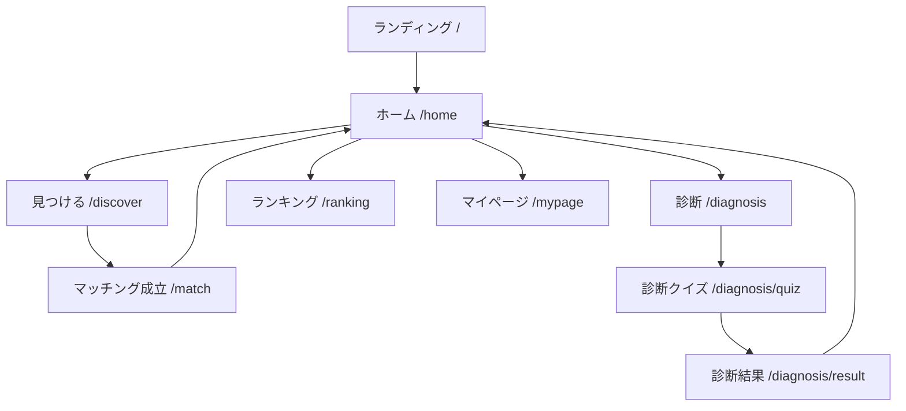
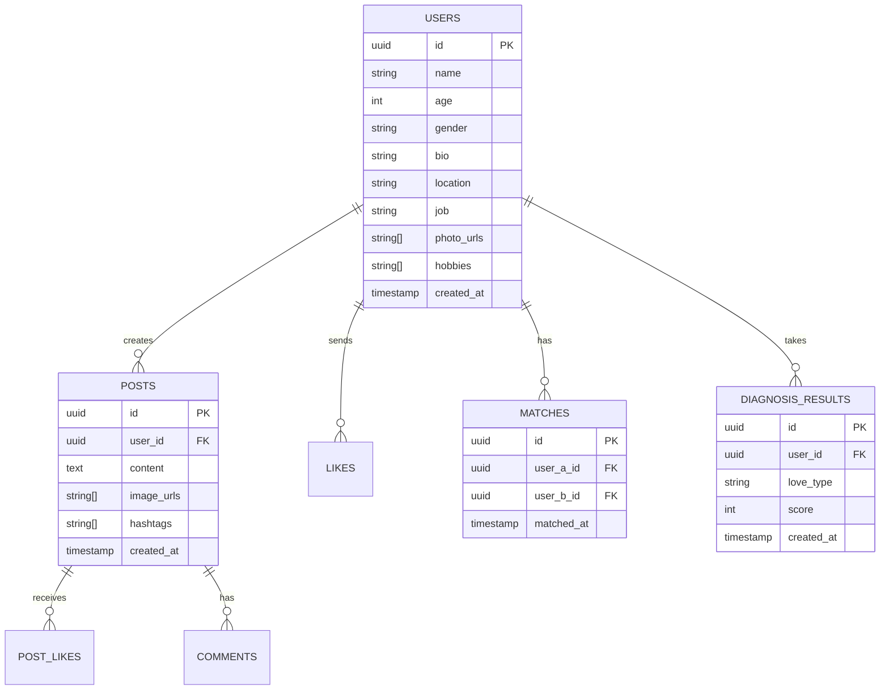
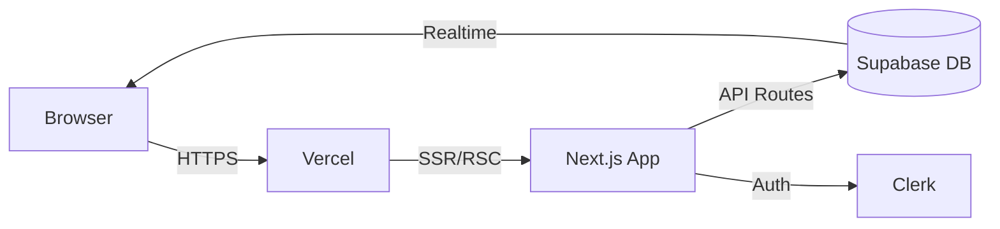
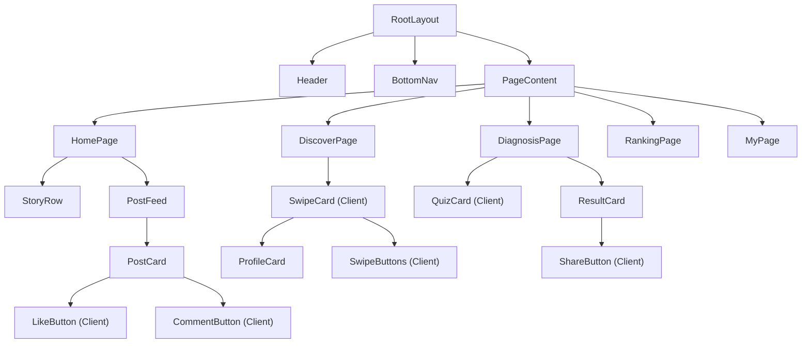

# 詳細要件定義書 - ときめき（Tokimeki）婚活SNS

## 1. プロジェクト概要

### 1.1 プロジェクト名
**ときめき（Tokimeki）** - バズる婚活SNSアプリ

### 1.2 背景・目的
- 背景：婚活アプリの離脱率の高さ・SNS世代のエンタメ欲求
- 目的：診断コンテンツのバイラル × スワイプマッチング × タイムラインSNSで婚活を楽しくする

### 1.3 スコープ
- WebアプリとしてMVPを実装
- モックデータで動作（認証・DB連携は次フェーズ）

---

## 2. 機能要件

### 2.1 機能一覧

| 機能ID | 機能名 | 要約 | MVP |
|--------|--------|------|-----|
| F-001 | ランディングページ | サービス紹介・登録促進 | Yes |
| F-002 | プロフィールカード | 自分のプロフィール表示 | Yes |
| F-003 | スワイプマッチング | いいね/パスのカードUI | Yes |
| F-004 | 恋愛診断クイズ | 10問の診断コンテンツ | Yes |
| F-005 | 診断結果シェア | SNSシェア用ページ | Yes |
| F-006 | タイムライン | 投稿フィード・いいね・コメント | Yes |
| F-007 | ランキング | 人気ユーザー・トレンド | Yes |
| F-008 | マイページ | プロフィール・マッチング一覧 | Yes |
| F-009 | マッチング成立演出 | アニメーション・お祝い画面 | Yes |
| F-010 | メッセージ（UI） | トーク画面（モック） | No（将来） |

### 2.2 データ構造

**User（ユーザー）**
```typescript
interface User {
  id: string;
  name: string;
  age: number;
  gender: 'male' | 'female' | 'other';
  photos: string[];          // URL配列
  bio: string;               // 自己紹介
  hobbies: string[];         // 趣味
  loveType?: LoveType;       // 恋愛タイプ（診断結果）
  location: string;          // 居住地
  job: string;               // 職業
  likedCount: number;        // いいね数
  matchedCount: number;      // マッチング数
  createdAt: string;
}
```

**Post（投稿）**
```typescript
interface Post {
  id: string;
  userId: string;
  userName: string;
  userPhoto: string;
  content: string;
  images?: string[];
  hashtags: string[];
  likeCount: number;
  commentCount: number;
  liked: boolean;            // 現在ユーザーがいいね済みか
  createdAt: string;
}
```

**LoveType（恋愛タイプ）**
```typescript
type LoveType =
  | 'romantic'    // ロマンチスト
  | 'logical'     // 論理派
  | 'free'        // 自由人
  | 'caring'      // 世話焼き
  | 'passionate'  // 情熱家
  | 'calm'        // 穏やか派
  | 'playful'     // 遊び好き
  | 'serious';    // 真剣派
```

**DiagnosisResult（診断結果）**
```typescript
interface DiagnosisResult {
  type: LoveType;
  title: string;
  description: string;
  strengths: string[];
  advice: string;
  compatibleTypes: LoveType[];
  emoji: string;
  color: string;
}
```

---

## 3. UI/UX設計

### 3.1 デザインコンセプト

**カラーパレット**
- Primary：`#F43F5E`（ローズ500）
- Primary Light：`#FB7185`（ローズ400）
- Primary Dark：`#E11D48`（ローズ600）
- Accent Gold：`#FBBF24`（アンバー400）
- Background：`#FFF1F2`（ローズ50）
- Surface：`#FFFFFF`
- Text Primary：`#1F2937`（グレー800）
- Text Secondary：`#6B7280`（グレー500）
- Border：`#FCE7F3`（ピンク100）

**タイポグラフィ**
- Font Family：`'Noto Sans JP', 'Inter', sans-serif`
- H1：32px / Bold
- H2：24px / Bold
- H3：20px / SemiBold
- Body：16px / Regular
- Caption：12px / Regular

### 3.2 画面一覧

| 画面ID | 画面名 | パス |
|--------|--------|------|
| P-001 | ランディング | `/` |
| P-002 | ホーム（タイムライン） | `/home` |
| P-003 | 見つける（スワイプ） | `/discover` |
| P-004 | 診断トップ | `/diagnosis` |
| P-005 | 診断進行 | `/diagnosis/quiz` |
| P-006 | 診断結果 | `/diagnosis/result` |
| P-007 | ランキング | `/ranking` |
| P-008 | マイページ | `/mypage` |
| P-009 | マッチング成立 | `/match` |

### 3.3 画面遷移図



### 3.4 主要画面ワイヤーフレーム

#### ホーム（タイムライン）
```
┌──────────────────────────────┐
│ ときめき                 🔔 ✉️ │  ← ヘッダー
├──────────────────────────────┤
│ ストーリー（横スクロール）    │
│ [○][○][○][○][○][○]+       │
├──────────────────────────────┤
│ ┌──────────────────────────┐ │
│ │ [写真] さくら • 28歳      │ │  ← 投稿カード
│ │ #婚活 #東京              │ │
│ │ 今日もいい天気🌸           │ │
│ │ ❤️ 42  💬 8             │ │
│ └──────────────────────────┘ │
│ ┌──────────────────────────┐ │
│ │ [写真] たくや • 31歳      │ │
│ │ ...                      │ │
│ └──────────────────────────┘ │
├──────────────────────────────┤
│ 🏠  💫  🔮  🏆  👤          │  ← BottomNav
└──────────────────────────────┘
```

#### 見つける（スワイプ）
```
┌──────────────────────────────┐
│ 見つける                 🔍  │
├──────────────────────────────┤
│ ┌──────────────────────────┐ │
│ │                          │ │
│ │      [プロフィール写真]    │ │
│ │                          │ │
│ │ さくら  28歳  東京         │ │
│ │ ✨ 共通点 5個             │ │
│ │ IT / カフェ / 旅行        │ │
│ └──────────────────────────┘ │
│                              │
│    [✕]  ────────  [♡]       │
│   パス              いいね   │
└──────────────────────────────┘
```

---

## 4. データベース設計

### 4.1 ER図



---

## 5. 技術スタック・アーキテクチャ

### 5.1 技術スタック
- Next.js 15（App Router）
- TypeScript 5.4+
- Tailwind CSS v4
- React 19
- Lucide React（アイコン）
- モックデータ（`lib/mock-data.ts`）

### 5.2 アーキテクチャ概要図



### 5.3 コンポーネント階層図



---

## 6. 非機能要件

| 区分 | 要件 | 目標値 |
|------|------|--------|
| パフォーマンス | LCP | 2.5秒以内 |
| パフォーマンス | FID | 100ms以内 |
| セキュリティ | 認証 | JWT + HTTPSOnly Cookie |
| スケーラビリティ | 同時接続 | 1万ユーザー |
| アクセシビリティ | 基準 | WCAG AA |
| ブラウザ | 対応 | iOS Safari 16+ / Chrome 120+ |

---

## 7. ランニング費用（概算・仮定）

| サービス | プラン | 月額 |
|---------|--------|------|
| Vercel | Hobby（〜Proへ） | 無料〜$20 |
| Supabase | Free（〜Pro） | 無料〜$25 |
| Clerk | Free（〜Pro） | 無料〜$25 |
| **合計** | | **〜$70/月** |
